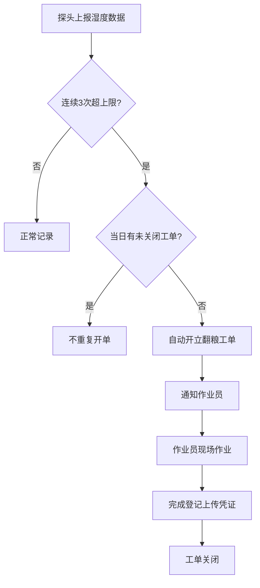

## 1. 产品概述

苏北合作社晒谷场湿度监控与翻粮工单系统，用于实时监控晒谷场粮堆湿度，自动触发翻粮工单，实现晒场数字化管理。

- 解决晒谷场霉变风险，通过湿度探头自动监测，连续超标自动触发翻粮任务
- 目标用户：合作社管理员、现场作业员
- 核心价值：降低霉变损失，提高作业效率，实现工单全流程可追溯

## 2. 核心功能

### 2.1 用户角色

| 角色 | 登录方式 | 核心权限 |
|------|----------|----------|
| 管理员 | 账号密码登录 | 晒场管理、探头配置、查看所有工单、系统设置 |
| 作业员 | 账号密码登录 | 查看晒场状态、处理待办工单、登记完成、查询历史工单 |

### 2.2 功能模块

1. **实时状态页面**：晒场列表卡片、实时湿度显示、超标预警、探头数据趋势
2. **工单待办页面**：待处理工单列表、工单详情、完成登记
3. **历史工单页面**：工单查询筛选、工单详情查看、导出功能
4. **晒场管理页面**：晒场信息维护、探头配置、湿度上限设置

### 2.3 页面详情

| 页面名称 | 模块名称 | 功能描述 |
|-----------|-------------|---------------------|
| 实时状态 | 晒场概览卡片 | 展示晒场编号、面积、当前湿度、湿度上限、状态标签（正常/预警/超标） |
| 实时状态 | 湿度趋势图 | 近2小时湿度变化曲线，标记上限阈值线 |
| 工单待办 | 待办列表 | 按优先级排序的待处理工单，显示晒场编号、超标时长、创建时间 |
| 工单待办 | 完成登记 | 上传作业照片、填写作业时长、备注信息 |
| 历史工单 | 筛选查询 | 按日期范围、晒场编号、工单状态筛选 |
| 历史工单 | 工单详情 | 查看完整工单生命周期：创建→处理→完成 |
| 晒场管理 | 晒场CRUD | 新增/编辑/删除晒场信息，设置翻粮湿度上限 |

## 3. 核心流程

### 自动开单流程
探头每10分钟上报湿度数据 → 系统检查该晒场最近3次上报（连续20分钟）→ 若全部高于上限 → 检查当日是否已有未关闭工单 → 无则自动开立翻粮工单 → 推送通知给作业员

### 工单处理流程
作业员查看待办工单 → 前往指定晒场作业 → 作业完成后登记 → 上传照片、填写作业信息 → 工单状态变为已完成

### 流程图

## 4. 用户界面设计

### 4.1 设计风格
- 主色调：农业主题绿色系（#2d5a27 深绿），辅助色：琥珀橙（#d97706 预警）、红色（#dc2626 超标）
- 按钮风格：圆角4px，悬停有轻微阴影和颜色加深
- 字体：正文使用系统无衬线字体，标题使用思源黑体
- 布局：左侧导航栏 + 右侧内容区，卡片式布局
- 图标：使用农业相关图标（麦穗、水滴、太阳、工单剪贴板等）

### 4.2 页面设计概述

| 页面名称 | 模块名称 | UI元素 |
|-----------|-------------|-------------|
| 实时状态 | 晒场卡片 | 网格布局，状态色边框，湿度仪表盘动画，超标时脉冲动画提示 |
| 实时状态 | 趋势图 | 平滑曲线图，超标区域红色填充，鼠标悬停显示数值 |
| 工单待办 | 列表项 | 左侧状态色条，优先级标签，倒计时显示超标时长 |
| 工单待办 | 登记表单 | 分步表单，照片上传预览，提交成功动画 |
| 历史工单 | 数据表格 | 斑马纹，状态筛选标签，分页器 |

### 4.3 响应式
- 桌面端优先设计，支持平板端自适应
- 移动端简化导航为底部标签栏，卡片单列布局
- 触控目标不小于44x44px

### 4.4 演示流程
系统启动时预置演示数据，自动模拟1号晒场湿度超标流程：
1. 初始状态：3个晒场，湿度正常
2. 模拟1号晒场连续3次上报湿度超上限（75%、78%、80%，上限70%）
3. 系统自动开立工单
4. 作业员完成登记，工单关闭
5. 完整流程可在历史工单中查询
