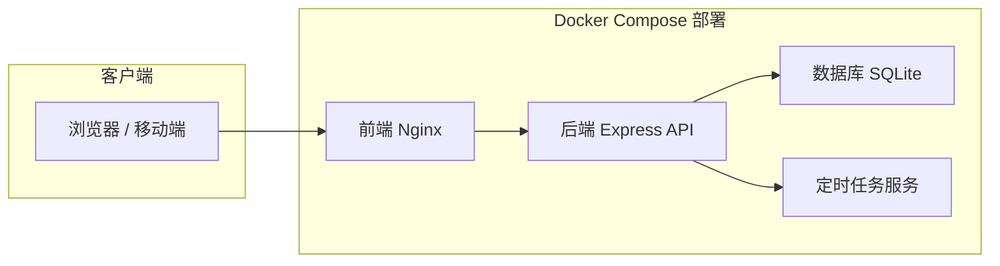
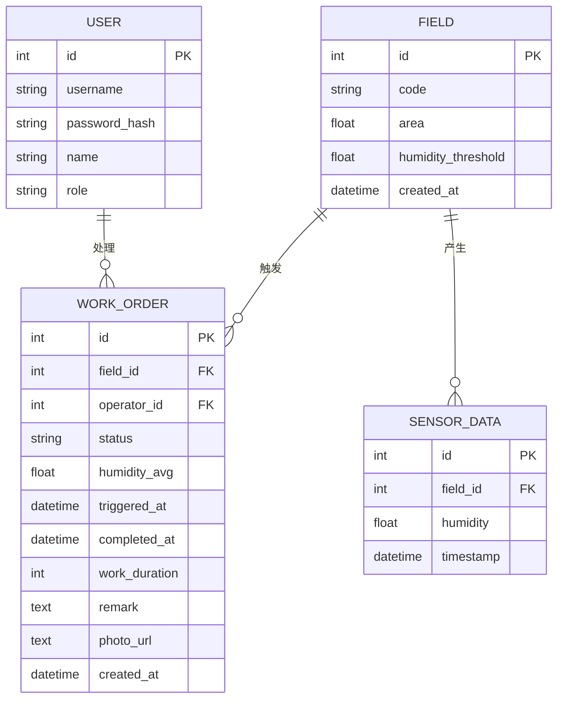

## 1. 架构设计



## 2. 技术描述

- 前端：React@18 + TypeScript + Vite + TailwindCSS@3 + Zustand + React Router + Recharts
- 后端：Express@4 + TypeScript + better-sqlite3
- 数据库：SQLite（单机部署，文件存储）
- 部署：Docker Compose，容器包含前端Nginx、后端Node服务
- 定时任务：node-cron 模拟探头数据上报，检测湿度超标

## 3. 目录结构

```
.
├── src/                    # 前端源码
│   ├── components/        # 组件
│   ├── pages/            # 页面
│   ├── hooks/            # 自定义Hooks
│   ├── store/            # Zustand状态管理
│   ├── utils/            # 工具函数
│   └── types/            # TypeScript类型
├── api/                   # 后端源码
│   ├── controllers/      # 控制器
│   ├── services/         # 业务逻辑
│   ├── models/           # 数据模型
│   ├── routes/           # 路由
│   └── tasks/            # 定时任务
├── shared/                # 前后端共享类型
├── migrations/            # 数据库初始化脚本
├── docker/                # Docker配置
├── docker-compose.yml     # Docker Compose配置
└── README.md             # 项目说明
```

## 4. 路由定义

| 前端路由 | 页面 | 权限 |
|-------|------|------|
| /login | 登录页 | 公开 |
| /dashboard | 实时状态 | 登录用户 |
| /todos | 工单待办 | 登录用户 |
| /history | 历史工单 | 登录用户 |
| /fields | 晒场管理 | 管理员 |

## 5. API 定义

### 5.1 认证接口

```typescript
// POST /api/auth/login
interface LoginRequest {
  username: string;
  password: string;
}
interface LoginResponse {
  token: string;
  user: {
    id: number;
    username: string;
    role: 'admin' | 'operator';
    name: string;
  };
}
```

### 5.2 晒场接口

```typescript
// GET /api/fields - 获取晒场列表
// POST /api/fields - 新增晒场
// PUT /api/fields/:id - 更新晒场
// DELETE /api/fields/:id - 删除晒场

interface Field {
  id: number;
  code: string;           // 晒场编号
  area: number;           // 面积(平方米)
  humidityThreshold: number; // 翻粮湿度上限(%)
  currentHumidity: number;  // 当前湿度
  status: 'normal' | 'warning' | 'alarm';
  createdAt: string;
}
```

### 5.3 探头数据接口

```typescript
// GET /api/sensor-data?fieldId=:id&hours=:hours
// POST /api/sensor-data - 探头上报

interface SensorData {
  id: number;
  fieldId: number;
  humidity: number;
  timestamp: string;
}
```

### 5.4 工单接口

```typescript
// GET /api/work-orders?status=:status
// GET /api/work-orders/:id
// POST /api/work-orders/:id/complete

interface WorkOrder {
  id: number;
  fieldId: number;
  fieldCode: string;
  status: 'pending' | 'processing' | 'completed' | 'cancelled';
  humidityAvg: number;        // 触发时平均湿度
  triggeredAt: string;
  completedAt?: string;
  operatorId?: number;
  operatorName?: string;
  workDuration?: number;      // 作业时长(分钟)
  remark?: string;
  photoUrl?: string;
  createdAt: string;
}

interface CompleteWorkOrderRequest {
  workDuration: number;
  remark: string;
  photoBase64?: string;
}
```

## 6. 数据模型

### 6.1 ER 图



### 6.2 DDL 语句

```sql
-- 用户表
CREATE TABLE users (
  id INTEGER PRIMARY KEY AUTOINCREMENT,
  username VARCHAR(50) UNIQUE NOT NULL,
  password_hash VARCHAR(255) NOT NULL,
  name VARCHAR(100) NOT NULL,
  role VARCHAR(20) NOT NULL DEFAULT 'operator',
  created_at DATETIME DEFAULT CURRENT_TIMESTAMP
);

-- 晒场表
CREATE TABLE fields (
  id INTEGER PRIMARY KEY AUTOINCREMENT,
  code VARCHAR(50) UNIQUE NOT NULL,
  area DECIMAL(10,2) NOT NULL,
  humidity_threshold DECIMAL(5,2) NOT NULL,
  created_at DATETIME DEFAULT CURRENT_TIMESTAMP
);

-- 探头数据表
CREATE TABLE sensor_data (
  id INTEGER PRIMARY KEY AUTOINCREMENT,
  field_id INTEGER NOT NULL,
  humidity DECIMAL(5,2) NOT NULL,
  timestamp DATETIME DEFAULT CURRENT_TIMESTAMP,
  FOREIGN KEY (field_id) REFERENCES fields(id)
);

-- 工单表
CREATE TABLE work_orders (
  id INTEGER PRIMARY KEY AUTOINCREMENT,
  field_id INTEGER NOT NULL,
  operator_id INTEGER,
  status VARCHAR(20) NOT NULL DEFAULT 'pending',
  humidity_avg DECIMAL(5,2) NOT NULL,
  triggered_at DATETIME NOT NULL,
  completed_at DATETIME,
  work_duration INTEGER,
  remark TEXT,
  photo_url TEXT,
  created_at DATETIME DEFAULT CURRENT_TIMESTAMP,
  FOREIGN KEY (field_id) REFERENCES fields(id),
  FOREIGN KEY (operator_id) REFERENCES users(id)
);

-- 索引
CREATE INDEX idx_sensor_data_field_time ON sensor_data(field_id, timestamp DESC);
CREATE INDEX idx_work_orders_status ON work_orders(status);
CREATE INDEX idx_work_orders_field_date ON work_orders(field_id, DATE(created_at));
```

### 6.3 初始化数据（演示用）

```sql
-- 用户
INSERT INTO users (username, password_hash, name, role) VALUES 
('admin', '$2b$10$...', '张管理员', 'admin'),
('operator1', '$2b$10$...', '李作业员', 'operator');

-- 晒场
INSERT INTO fields (code, area, humidity_threshold) VALUES 
('A-01', 500.00, 70.00),
('A-02', 600.00, 70.00),
('B-01', 450.00, 68.00);

-- 模拟历史数据（演示1号晒场超标流程）
INSERT INTO sensor_data (field_id, humidity, timestamp) VALUES 
(1, 65.5, DATETIME('now', '-30 minutes')),
(1, 75.0, DATETIME('now', '-20 minutes')),
(1, 78.0, DATETIME('now', '-10 minutes')),
(1, 80.0, DATETIME('now'));

-- 演示工单（已完成）
INSERT INTO work_orders (field_id, operator_id, status, humidity_avg, 
  triggered_at, completed_at, work_duration, remark, created_at) VALUES 
(1, 2, 'completed', 77.67, DATETIME('now'), DATETIME('now', '+45 minutes'), 
  45, '翻粮完成，湿度已下降至68%', DATETIME('now'));
```

## 7. 核心业务逻辑

### 7.1 自动开单检测逻辑

```typescript
function checkAndCreateWorkOrder(fieldId: number): void {
  // 获取最近3条数据（覆盖20分钟区间）
  const recentData = db
    .prepare('SELECT humidity FROM sensor_data WHERE field_id = ? ORDER BY timestamp DESC LIMIT 3')
    .all(fieldId);
  
  if (recentData.length < 3) return;
  
  const field = db.prepare('SELECT * FROM fields WHERE id = ?').get(fieldId);
  const allOverThreshold = recentData.every(d => d.humidity > field.humidity_threshold);
  
  if (!allOverThreshold) return;
  
  // 检查当日是否有未关闭工单
  const today = new Date().toISOString().split('T')[0];
  const existingOpenOrder = db.prepare(`
    SELECT id FROM work_orders 
    WHERE field_id = ? AND status IN ('pending', 'processing')
    AND DATE(created_at) = ?
  `).get(fieldId, today);
  
  if (existingOpenOrder) return;
  
  // 创建工单
  const avgHumidity = recentData.reduce((sum, d) => sum + d.humidity, 0) / recentData.length;
  db.prepare(`
    INSERT INTO work_orders (field_id, status, humidity_avg, triggered_at)
    VALUES (?, 'pending', ?, ?)
  `).run(fieldId, avgHumidity, new Date().toISOString());
}
```

### 7.2 探头数据模拟任务

每10分钟为每个晒场生成模拟湿度数据，演示场景下1号晒场会连续超标触发工单。
